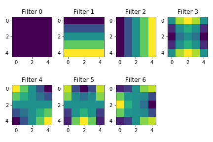
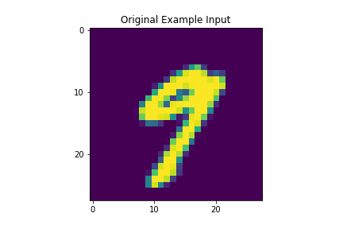
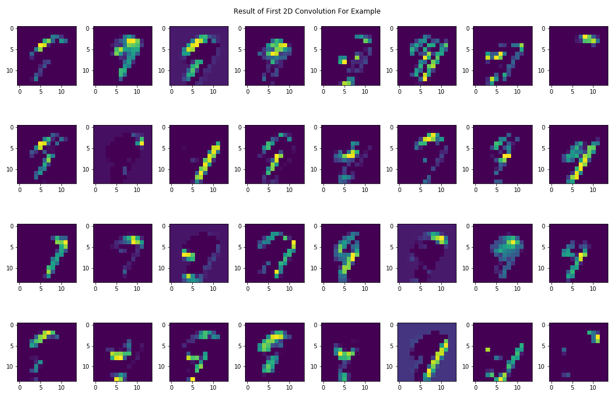

# MNIST Digit Recognition

In this project we experiment with variations on performing digit recognition with the standard MNIST data set.

## Data Set

The data set used is the standard MNIST dataset found at
[http://yann.lecun.com/exdb/mnist/](http://yann.lecun.com/exdb/mnist/). The data consists of
28 by 28 gray scale images (values from 0 to 255). Each image is a picture of a hand-written digit (one of
0 to 9).

 The exact file format is as follows: 

### Image File Format

```
[offset] [type]          [description] 
0000     32 bit integer  magic number 
0004     32 bit integer  number of images 
0008     32 bit integer  number of rows 
0012     32 bit integer  number of columns 
0016     unsigned byte   pixel 
0017     unsigned byte   pixel 
........ 
xxxx     unsigned byte    pixel
```

### Label File Format

```
[offset] [type]          [description] 
0000     32 bit integer  magic number (MSB first) 
0004     32 bit integer  number of items 
0008     unsigned byte   label 
0009     unsigned byte   label 
........ 
xxxx     unsigned byte   label
The labels values are 0 to 9.
```

## Notebooks

We have the following notebooks:

### Low-Dimension Covolution Filters Using Harmonic Polynomials

####[tensorflow\_harmonic\_poly\_filters.ipynb](tensorflow_harmonic_poly_filters.pynb)

Look at restricting the convolutional filters to a low-dimensional space consisting of harmonic polynomials. 
The normal filter consists of a `5x5` patch for each input channel and output channel; i.e. a tensor of 
shape `(5, 5, n_input_channels, n_output_channels)`. Each `5x5` patch has dimension `25` when the 
coefficients of the patch are not restricted.

Here we reduce the dimensions of each `5x5` patch to a lower-dimensional sub-space, in particular we look 
at restricting each `5x5` patch to have values in the space of harmonic polynomials of `x` and `y` 
with degree at most `3`. This is a `7`-dimesional space. This greatly reduces the number of 
trainable coefficients in the model.

Here is what the harmonic filter basis looks like:



For the following example:



this is the output of the first 2d convolution and 2d pooling:


